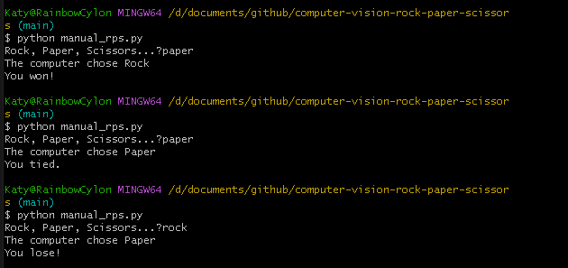

# Computer Vision RPS

## Milestone 2
I created the model for the rock, paper, scissors game, training the model with several images from my webcam of the rock, paper and scissors poses as well as doing nothing as a control.
Technologies used: Teachable machine programme, downloaded through Tensorflow. This will allow me to assign the poses to the users actions and hopefully identify who will win or lose. 

## Milestone 4
I created the game rock paper scissors with a user input, where the computer chooses between Rock, Paper, or Scissors, compares it to the users input and then a winner is decided based on the normal outcomes for a rock paper scissors game.
Technologies used: python
python```
import random

options = ['Rock', 'Paper', 'Scissors']

def get_computer_choice():
    computer_choice = (random.choice(options))
    return computer_choice

def get_user_choice():
    user_choice = input('Rock, Paper, Scissors...?')
    while True:
        if user_choice.capitalize() in options:
            return user_choice.capitalize()
        else:
            print('That is not an option.')
            user_choice = input('Rock, Paper, Scissors...?')


def get_winner(computer_choice, user_choice):
    if user_choice == computer_choice:
        print('You tied.')
    elif user_choice == 'Rock' and computer_choice == 'Scissors' or user_choice == 'Paper' and computer_choice == 'Rock' or user_choice == 'Scissors' and computer_choice == 'Paper':
        print('You won!')
    else:
        print('You lose!')

def play():
    computer_choice = get_computer_choice()
    user_choice = get_user_choice()
    print(f'The computer chose {computer_choice}')
    get_winner(computer_choice, user_choice)

play()
```
